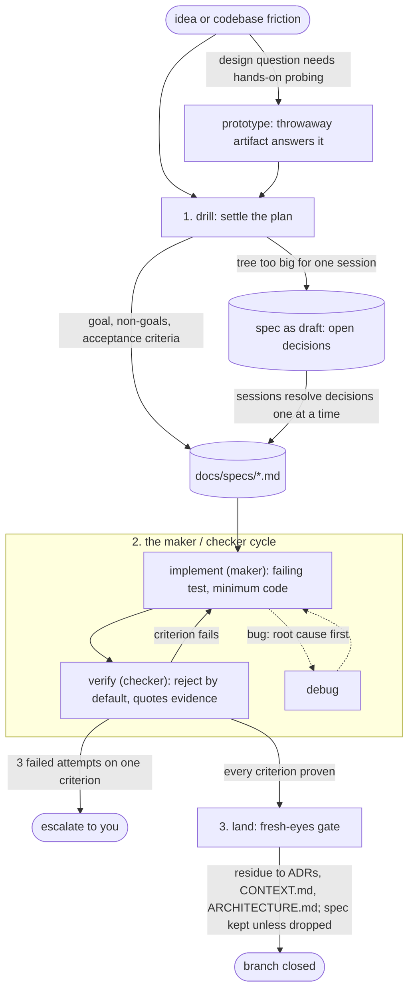

# skills

A development loop for [Claude Code](https://docs.claude.com/en/docs/claude-code): connected skills that carry work from fuzzy plan to landed branch, on any project. Not a pile of skills; one flow with a fast path and a deep dial.

## Install

Pick one path. Installing both loads every skill twice in Claude Code.

**Claude Code plugin** (read-only, updates via version):

```bash
claude plugin marketplace add pwguler/skills
claude plugin install gitshrl-skills
```

**Script** (editable copies for opencode and codex, plus the instruction layer):

```bash
curl -fsSL https://raw.githubusercontent.com/pwguler/skills/main/install.sh | bash
```

The script installs skills to `~/.agents/skills/` (opencode and codex), deploys `CLAUDE.md` + `RTK.md` to `~/.claude/` (with a backup of any existing file), and wires the codex symlink, the opencode gating, and rtk. Idempotent: re-run to update. Restart Claude Code afterward.

Switching from the script to the plugin: remove the legacy copies so the suite loads once:

```bash
rm -rf ~/.claude/skills/{architecture,core-interview,debug,deep,drill,implement,land,parallel,prototype,research,teach,verify,which-skill,write-skill}
```

## The loop

The base suite (drill → implement → verify → land) implements the run-until-done loop: a bounded goal, a maker/checker cycle, an exit only on proven criteria. Fast path: an obvious task skips the interview; one sentence is the spec, once it passes the fork test. If `verify` fails twice, the task was lying: route back through drill. `/deep` is user-only and turns every fast path off for the session.



The documents the suite maintains, all created lazily with no setup step: `CONTEXT.md` (domain glossary, born from the first resolved term), `ARCHITECTURE.md` (the system as it is), `docs/adr/` (hard-to-reverse decisions), `docs/specs/<slug>.md` (the loop's steering artifact; a spec kept after its branch is a record of why the code looks the way it does).

## When to use what

| Moment | Skill |
|---|---|
| New plan, feature, or design | `drill` |
| Design question needs a throwaway artifact before committing | `prototype` |
| Implementing a settled plan | `implement` |
| Bug or unexpected behavior | `debug` |
| About to claim done, fixed, or passing | `verify` |
| Existing code fights you | `architecture` |
| Reading legwork | `research` |
| Branch done, needs merging or a PR | `land` |
| Independent failures or tasks, two or more | `parallel` |
| Multi-task plan to execute hands-off | `parallel` |
| Authoring or editing a skill | `write-skill` |
| Learning a topic across sessions | `teach` |
| Risky or ambiguous work, full rigor wanted | `deep` |
| None of the above comes to mind | `which-skill` |
