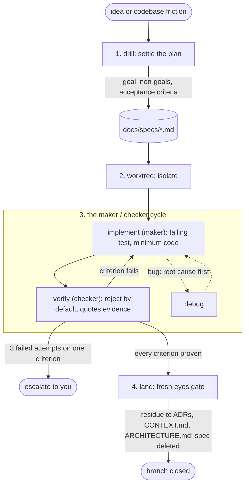

# skills

My [Claude Code](https://docs.claude.com/en/docs/claude-code) agent skills: a connected base suite that applies to any project, plus the engineering guidelines I run.

## Quick start (fresh machine)

One command sets up everything. All skills go to `~/.claude/skills/`, `CLAUDE.md` + `RTK.md` go to `~/.claude/`, and [rtk](https://github.com/rtk-ai/rtk) is installed + hooked:

```bash
curl -fsSL https://raw.githubusercontent.com/gitshrl/skills/main/install.sh | bash
```

Or from a clone: `git clone https://github.com/gitshrl/skills && ./skills/install.sh`

Idempotent: re-run any time to update (existing `CLAUDE.md`/`RTK.md` are backed up). Restart Claude Code afterward. Needs `git`, `curl`, and the `claude` CLI; rtk requires nothing extra (prebuilt binary).

## Base suite

The skills in `base/` are connected and project-agnostic.

| Skill | Purpose | How to invoke | Invocation |
|---|---|---|---|
| **drill** | Stress-test a plan or design. A relentless one-question-at-a-time interview, each question with a recommended answer, until every branch of the decision tree is resolved. Implementation work ends as a spec in `docs/specs/`. | `/drill`, or say "drill this plan" | model |
| **domain-model** | The same interview, but against the project's language. Calls out terms that conflict with the glossary, sharpens fuzzy ones, stress-tests relationships with concrete scenarios, and updates `CONTEXT.md`/ADRs inline as decisions crystallize. | `/domain-model` | user only |
| **prototype** | Throwaway code that answers a design question. Logic branch: a tiny terminal app to push a state machine or data model through hard cases. UI branch: several radically different variations on one route. The answer lands in main; the prototype itself is captured on a `proto/<slug>` branch as a primary source. | `/prototype`, or say "prototype this" | model |
| **implement** | Work a settled plan test-first, one thin slice at a time: failing test, minimum code, refactor green. With a spec, the criteria are the plan. Routes bugs to `debug`, escalates after three failed attempts, ends by running `verify`. | `/implement`, or say "build it" | model |
| **debug** | Root-cause a bug before fixing it: reproduce, trace to first cause, verify one hypothesis with evidence, fix, add the regression test. | `/debug`, or just report a bug | model |
| **verify** | Prove a claim of done, fixed, or passing by running the commands and reading the output before making it. Reject by default; with a spec, gates criterion by criterion and enforces the non-goals. | `/verify`, fires before completion claims | model |
| **architecture** | Scan the codebase for deepening opportunities: shallow modules to consolidate, seams to strengthen. Presents candidates, interviews you through the one you pick, and can fan out sub-agents to design rival interfaces for it. Reads and maintains `ARCHITECTURE.md`, the living map of the system. | `/architecture` | model |
| **core-interview** | Internal support: the interview loop `drill`, `domain-model`, and `architecture` delegate to. Other skills trigger it; you don't invoke it directly. | none | model, only via other skills |

How they connect:

### The loop

The base implements the run-until-done loop: a bounded goal, a maker/checker cycle, an exit only on proven criteria. Four principles:

1. **The goal defines finishing; the loop only executes.** The spec's acceptance criteria are the exit condition. `implement` and `verify` cycle (a failing criterion sends work back) until every criterion is proven. Nothing is done because it feels done.
2. **The maker never checks its own work, and the checker's default stance is reject.** `verify` gates against the spec file, never conversation memory, and treats every claim as false until fresh output proves it. At `land` the final gate is a fresh subagent that reads only the spec and the diff.
3. **Attempts are capped.** Three failed attempts on the same criterion stop the loop and escalate to you with full context: the criterion, what was tried, the last error. Thrashing is a failure mode, not persistence.
4. **State lives in files, not the conversation.** The spec survives session death, context compaction, and machine switches. A fresh session picks the loop up from disk, no re-briefing.

**Fast path.** Ceremony scales with ambiguity, not with existence. An obvious task (no real decision tree, small diff) skips drill, the spec, and the worktree: state the single acceptance criterion in one sentence, implement test-first, and let `verify` gate the claim as always. If you can state the criterion in one sentence, that sentence is the spec. The tripwire: `verify` failing twice on an "obvious" task means it wasn't; stop and drill it.

Run it hands-off: `/delegate` executes the spec with a fresh subagent per criterion and a review after each. Or drive it with Claude Code's native loop primitives:

```bash
# one branch, bounded: re-enter the loop until the spec is proven
/loop /implement the spec at docs/specs/<slug>.md criterion by criterion; verify gates each; stop when all are proven or the attempt cap escalates

# recurring, unattended: discovery on a cadence, report-only until trusted
/loop 1d scan CI, open issues, and recent commits; surface what needs attention; propose only, do not edit code
```

Graduate an unattended loop the way you'd onboard a new hire: report-only first, small allowlisted fixes only after stable runs, human gate on anything risky. The skills carry the same guarantees either way: reject-by-default verification, attempt caps, spec-fenced scope.

One work item's path through the loop (`domain-model`, `prototype`, and `architecture` feed the plan stage; their document edges are in the tables below):



## Utilities

Skills at the repo root support any session without being a workflow step:

| Skill | Purpose | How to invoke | Invocation |
|---|---|---|---|
| **handoff** | Compact the session into a document the next session picks up. Pass an argument describing what the next session is for. | `/handoff "review the auth refactor"` | model |
| **research** | Spin up a background agent that investigates a question against primary sources (official docs, source code, specs) and writes the findings to a cited markdown file in the repo. | `/research`, or say "research X" | model |
| **teach** | A learning workspace: lessons, a mission, a glossary, and learning records that track what you actually understand across sessions. | `/teach` | user only |
| **worktree** | Isolated workspace before feature work: detect existing isolation, prefer the harness's native tool, fall back to git worktree under `.worktrees/`, verify a clean test baseline. | `/worktree` | model |
| **land** | Finish a branch: fresh-eyes spec gate first, then merge, PR, keep, or discard, with spec cleanup and worktree removal in the right order. PR bodies and merge commits are written from the spec, so the reason of the code survives it. | `/land` | model |
| **parallel** | One subagent per independent problem, all dispatched concurrently, integrated with a full-suite check. | `/parallel` | model |
| **delegate** | Execute a settled plan with a fresh subagent per task, a review after each, and a whole-branch review at the end. | `/delegate` | model |
| **write-skill** | Create or edit a skill test-first: record the failure without it, write the minimum that fixes it, close loopholes. | `/write-skill` | model |
| **which-skill** | The router. Describe your situation and it names the one skill (or short chain) that fits, reading every installed skill's frontmatter so the user-only ones are never missed. | `/which-skill "i want to X"` | user only |

## The documents the suite maintains

Four artifacts live in your project. Three are durable; one lives only as long as its branch:

- **`CONTEXT.md`**: the domain glossary, and nothing else. Terms meaningful to domain experts, free of implementation details. `domain-model` writes it as terms get resolved; `architecture` reads it so refactoring candidates speak your domain language. Repos with multiple bounded contexts use a root `CONTEXT-MAP.md` pointing to per-context `CONTEXT.md` files. Format: [`base/domain-model/CONTEXT-FORMAT.md`](./base/domain-model/CONTEXT-FORMAT.md).
- **`ARCHITECTURE.md`**: the system as it currently is: major modules and their responsibilities, load-bearing seams, invariants. Only what stays true for years; nothing a grep answers better; one page is the budget. `architecture` reads it before exploring (and offers to seed it on first contact); `land` and `architecture` update it inline the moment a change moves the system's shape, so it never drifts from the code. Format: [`base/architecture/ARCHITECTURE-FORMAT.md`](./base/architecture/ARCHITECTURE-FORMAT.md).
- **`docs/adr/`**: architectural decision records. Written sparingly, only when a decision is hard to reverse, surprising without context, the result of a real trade-off. `domain-model` and `architecture` offer them at the right moments; `architecture` treats existing ADRs as decisions not to re-litigate; `prototype` captures its verdict as an ADR when it passes the same test. Format: [`base/domain-model/ADR-FORMAT.md`](./base/domain-model/ADR-FORMAT.md).

- **`docs/specs/<slug>.md`**: one spec per work item, the loop's steering artifact. Goal, non-goals, checkable acceptance criteria, verification commands. `drill` writes it when the plan settles, `implement` turns criteria into failing tests, `verify` gates criterion by criterion, `land` routes durable residue to ADRs/`CONTEXT.md` and deletes it. Branch-lifetime by design; a spec that outlives its branch is stale documentation. Format: [`base/drill/SPEC-FORMAT.md`](./base/drill/SPEC-FORMAT.md).

  Deleted is not gone: every spec lives in git history, and `land` writes the PR body and merge commit from it. To review old specs: `git log --diff-filter=D --name-only --format="%h %s" -- docs/specs/` lists every spec that ever existed; `git show <commit>^:docs/specs/<slug>.md` reads one in full.

All are created lazily, with no setup step, on any codebase. The first resolved term creates `CONTEXT.md`; the first ADR creates `docs/adr/`; the first settled plan creates its spec; `architecture`'s first run (or the first shape-changing `land`) creates `ARCHITECTURE.md`. Skills that read them proceed silently when they're absent.

## From a fresh project

1. **`/drill`** the initial plan: walk the decision tree before any code exists. When the plan settles, drill writes the spec (goal, non-goals, acceptance criteria) to `docs/specs/`.
2. **`/domain-model`** once the plan has domain words in it: pin the vocabulary; `CONTEXT.md` is born from the first resolved term.
3. **`/prototype`** whichever design question survived both interviews still contested: a state model that "feels wrong" or a UI you can't picture. Keep the answer; delete the code or absorb the validated decision.
4. **`/implement`** criterion by criterion from the spec, test-first, in a `/worktree` when the work needs isolation. A bug mid-slice routes to `/debug`; `/verify` gates each criterion against fresh command output, three failed attempts escalate to you.
5. **`/land`** closes the loop: a fresh-eyes gate checks the diff against the spec, durable residue moves to ADRs/`CONTEXT.md`, the spec is deleted with the branch.
6. **`/handoff`** when the session runs long. The next session starts where this one stopped.

## In an existing codebase

1. **`/architecture`**: it explores the code (`ARCHITECTURE.md`, `CONTEXT.md`, and ADRs first, if present; on first contact it offers to seed the architecture map), then presents deepening candidates. Pick one; the interview walks constraints, dependencies, the shape of the deepened module, and what tests survive. Contested interface choices route to `/prototype`; resolved terms and rejected candidates land in `CONTEXT.md` and ADRs.
2. **`/drill`** any change plan before implementing it, same discipline as greenfield: the settled plan becomes a spec in `docs/specs/`, and the loop (worktree, implement, verify, land) runs against it.
3. **`/domain-model`** when a plan touches domain concepts the glossary doesn't cover. The codebase is cross-referenced against what you say, and contradictions surface immediately. On first contact with a codebase that has no `CONTEXT.md`, it offers a one-time seeding pass: candidate terms distilled from the code, each confirmed through the interview before it's written.
4. **`/handoff`** to bridge sessions, same as greenfield.

## When to use what

| Moment | Skill |
|---|---|
| New plan, feature, or design | `drill` |
| Domain language needs settling | `domain-model` |
| Design question talking can't answer | `prototype` |
| Implementing a settled plan | `implement` |
| Bug or unexpected behavior | `debug` |
| About to claim done, fixed, or passing | `verify` |
| Existing code fights you | `architecture` |
| Reading legwork | `research` |
| Work needs isolation from the checkout | `worktree` |
| Branch done, needs merging or a PR | `land` |
| Independent failures or tasks, two or more | `parallel` |
| Multi-task plan to execute hands-off | `delegate` |
| Authoring or editing a skill | `write-skill` |
| Learning a topic across sessions | `teach` |
| Session runs long | `handoff` |
| None of the above comes to mind | `which-skill` |

## Guidelines

[`CLAUDE.md`](./CLAUDE.md) is the agent's main instruction set, installed to `~/.claude/CLAUDE.md`.
